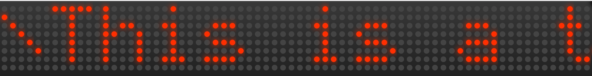
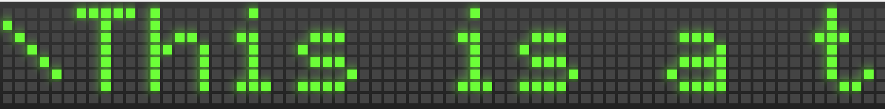

# LedMatrix

Vintage Matrix of LEDs to show messages

### Dependencies

jQuery

## Easy to use

Just include both files in your html page:

```
<script src="js/led-matrix.js"></script>
<script src="js/simpleMatrixFont.js"></script>
```

The first one is the object that controls all the logic for the board.
The second one is the definition of the font used.

You need also to include the CSS to format properly the LedMatrix board:

To have the board in a green squared fashion:

```
<link href='css/led-matrix-square-green.css' rel='stylesheet' type='text/css'>
```

And in a more vintage way, rounded led in red:

```
<link href='css/led-matrix-round-red.css' rel='stylesheet' type='text/css'>
```


## How it works:

Every single column works like a led trip

```
<div class="char_matrix" id="col_20">
    <ul>
        <li class="led active"></li>
        <li class="led"></li>
        <li class="led active"></li>
        <li class="led active"></li>
        <li class="led active"></li>
        <li class="led active"></li>
        <li class="led active"></li>
        <li class="led"></li>
    </ul>
</div>
```

As you can see every led ON has an 'active' class.

In order to draw faster the message on the board there is a preparation of
the message that converts the string in a sequence of true/false helped by the
font bits:

```
 var prepareMessage = function(message){
     var fontData = font.data;
     var result = [], j, i, r, byte, rowDef, bit;
     for(i=0; i<message.length; i++){
         var ch=message[i];
         if(fontData[ch] != 'undefined'){
             for(j=0; j<fontData[ch].length; j++) {
                 byte = fontData[ch][j];
                 rowDef = [];
                 bit = 1;
                 for(r = 0; r < rows; r++) {
                     rowDef.push((byte & bit) > 0);
                     bit *= 2;
                 }
                 result.push(rowDef);
             }
             // separator between letters
             result.push([false, false, false, false, false, false, false, false]);
         }
     }
     console.log(result);
     return result;
 };
```


This way is very easy to 'draw' the column, in order to do it quickly instead of change 
the class of every single led I decided to change the whole html of this column. 

Maybe there is a way to do quicker.


```
this.update = function(){
    var col, l = Math.min(this.data.length, this.cols);
    for (col = 0; col < l; col++) {
        drawCol('#col_'+col, this.data[col]);
    }
};    
  
var drawCol = function(col, data){
    var html = '<ul>';
    for (var i = 0; i < rows; i++) {
        html += '<li class="led'+(data[i] ? ' active' : '')+'"></li>';
    }
    $(col).html(html+'</ul>');
};
```

## Look&feel rounded red



## Look&feel squared green




## Online demo [here](http://classes.joseluislaso.com/led-matrix/index.html)